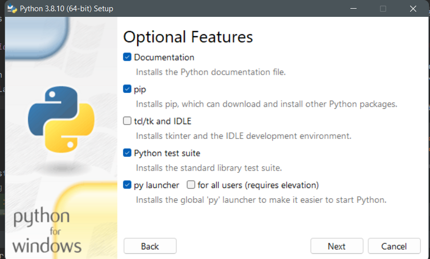

# KABADA AI

### Model description
AI model is a bayes network representing probability 
distribution over business plans. By conditiong Bayes network on 
already filled fields from UI - we can recommend most likely
field values for still unfilled fields.

### Implementation description

BayesFusion.org implementation of Bayes Network inference and training 
is used via python bindings. The AI application can be run as python 
application or as docker application.

### Installation and running on Windows host

To install python 3.8 on Your windows machine together with pip (python package manager) run 
python-3.8.10.exe (for 32 bit machine) or python-3.8.10-amd64.exe (for 64 bit machine). Both exe files 
are in the root directory of this repository.
In the prompt push Customize button and fill the tick boxes as in image bellow and install python.



After that install necessary python libraries with these commands
```buildoutcfg
pip install -r requirements.txt
pip install --no-cache-dir --index-url https://support.bayesfusion.com/pysmile-A/ pysmile
```

To start application go to this repository's root directory and run 
```buildoutcfg
python app.py --ip=localhost --port=2222
```
this command will start rest api. You can change ip adress ad port of 
the service by providing corresponding script parameter values. 

#### Testing on windows
To test if all necessary components are installed start the rest server
as describer previously. Then also from repository's root directory run
```buildoutcfg
python tests/fake_client.py
```
This script will generate random business plans and send it to AI application.
for processing 4 times. If this script terminates without error - AI 
application is installed succesfully.

### Installation and running as docker container

To build docker image
```buildoutcfg
docker build -t kabada_ai .
```

To start AI service for the first time
```buildoutcfg
docker run --name kaby -v shared_files:/shared_files -d -p 2222:2222 kabada_ai
```
To start AI service next time
```buildoutcfg
docker start kaby
```

To shutdown the service
```buildoutcfg
docker stop kaby
```

Service url is ``localhost:2222``

